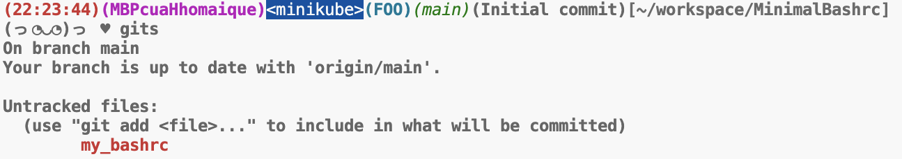

# MinimalBashrc

I'm the type of person who doesn't like fancy or redundant things. Here is my streamlined bashrc file containing only the things I really need and nothing else.
- I use Bash on Linux, need to rework it a bit for zshrc or on MacOS.
- The color is set based on my terminal light theme and needs to be reworked for personal terminal context.
- Many functions like gits, kns, ctn which I defined to use it directly
- Please get rid of anything you feel is unnecessary.

Demo from my terminal on MacOS:

