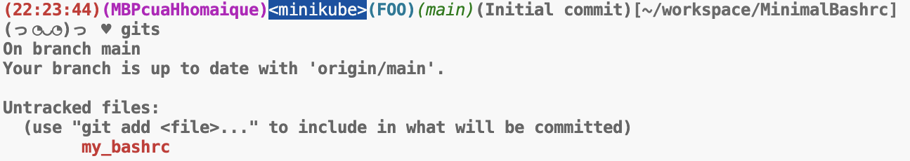

# MinimalBashrc

I'm the type of person who doesn't like fancy or redundant things.
Here is my streamlined bashrc file containing only the things I really need and nothing else.
Please get rid of anything you feel is unnecessary.

## 🚀 Key Features

### ⚙️ **Kubernetes Integration**
- **Namespace Management**: `kns` function for easy namespace switching
- **Multi-cluster Support**: `ek` function for kubeconfig switching
- **Pod Utilities**: `ctn` for container inspection, `po` for pod listing
- **On-demand initialization**: `kinit_ns` creates the default working namespace when requested
- **Safety Features**: Highlights dangerous default namespace usage

### 🔧 **Git Enhancements**
- **Smart Aliases**: `gits`, `gitb`, `gitc`, `gitl` for common operations
- **Submodule Support**: `gitp` pulls with automatic submodule updates
- **Branch Comparison**: `headsgit` compares local/remote/fetch heads
- **Safety Warnings**: Visual alerts for master/main branch usage
- **Commit Helpers**: Quick amend and change tracking functions

### 🎨 **Intelligent Prompt**
The custom prompt displays contextual information:
- 🌐/💻 **Location indicator** (VPS/Local)
- 💰 **Bitcoin price** (cached with short network timeouts)
- 📊 **System stats** (Docker containers, screen sessions)
- ⏰ **Timestamp** for debugging
- 🖥️ **Hostname** for multi-server workflows
- ☸️ **Kubernetes context** (highlighted if non-default)
- 📁 **Namespace** (highlighted if dangerous)
- 🌿 **Git branch** (highlighted if master/main)
- 💬 **Last commit message** (prevents wrong amends)
- 📂 **Current directory**

### 🛠️ **Utility Functions**
- **Repository Sync**: `reposync` for main→test repo synchronization
- **Quick Navigation**: `cd1`, `cd2` for frequent directories
- **Bashrc Management**: `editbash`, `sourcebash` for quick config changes
- **Central Python venvs**: per-project virtualenvs in `~/.venvs` with automatic activation
- **System Monitoring**: Docker and screen session counters

## 📋 Function Reference

### Kubernetes Functions
```bash
kns [namespace]     # Switch to namespace or show current
kinit_ns            # Create DEFAULT_NS in the current cluster if needed
ek [config]         # Switch kubeconfig or show current
ctn <pod_name>      # List all containers in a pod
ns [args]           # List namespaces by creation time
po [args]           # List pods in current namespace
```

### Git Functions
```bash
gitp [args]         # Git pull with submodule update
gitpush [args]      # Git push wrapper
gitchanges          # Show files changed in last commit
gitamend            # Amend to current commit (no edit)
headsgit            # Compare local/remote/fetch heads
```

### Utility Functions
```bash
reposync [--delete] # Sync main repo to test repo (optionally delete missing files)
cd1                 # Navigate to main repository
cd2                 # Navigate to test repository
editbash            # Edit bashrc file
sourcebash          # Reload bashrc configuration
```

### Python Virtualenv Functions
```bash
create_central_venv [name]    # Create and activate ~/.venvs/<name>
activate_central_venv <name>  # Activate an existing central venv
list_central_venvs            # List central venvs
central_venv_path [name]      # Print the central venv path
```

When a matching central venv exists, entering `~/project-name` automatically activates
`~/.venvs/project-name`. Leaving the project deactivates only venvs that were
auto-activated.

### Useful Aliases
```bash
# Navigation
..                  # cd ..
...                 # cd ../..

# Enhanced ls
ll                  # ls -la (detailed list)
la                  # ls -A (show hidden)
l                   # ls -CF (classify)

# Git shortcuts
gits                # git status
gitb                # git branch
gitc                # git checkout
gitl                # git log --oneline

# Safe operations
cp, mv, rm          # Interactive mode by default (-i)
```

## 🔧 Installation & Setup

1. **Backup your current bashrc**:
   ```bash
   cp ~/.bashrc ~/.bashrc.backup
   ```

2. **Copy the configuration**:
   ```bash
   cp my_bashrc ~/.bashrc
   ```

3. **Customize paths and sync settings** (edit these in the file):
   ```bash
   # Update these paths to match your setup
   cd1() { cd /path/to/main_repo; }
   cd2() { cd /path/to/test_repo; }

   # Repository sync configuration
   LOCAL_REPO="/your/main-repo"
   REMOTE_REPO="/path/on/remote/host"
   HOST="user@hostname"
   SYNC_EXCLUDES=( ".git" "__pycache__" ".venv" )
   ```

4. **Set your default context**:
   ```bash
   export DEFAULT_CONTEXT="your_working_context"
   export DEFAULT_NS="your_working_namespace"
   ```

5. **Reload your shell**:
   ```bash
   source ~/.bashrc
   ```

6. **Optional: create your default Kubernetes namespace**:
   ```bash
   kinit_ns
   ```

7. **Optional: create central Python virtualenvs**:
   ```bash
   cd ~/my-python-project
   create_central_venv
   python -m pip install -r requirements.txt
   ```

   After the venv exists, future `cd ~/my-python-project` commands auto-activate it.

## 🖥️ Terminal Screenshots

Demo from terminal on macOS:
<p align="center"></p>

Another terminal example:
<p align="center"></p>

## 🔧 Customization

### Colors
All colors are defined in the `COLOR DEFINITIONS` section. Modify these variables to match your terminal theme:
```bash
RED="\[\e[01;31m\]"
GREEN="\[\e[01;32m\]"
# ... etc
```

### Prompt Components
Enable/disable prompt components by modifying the `reload_ps()` function. Comment out unwanted elements:
```bash
# local btc_format="${GREEN}(\$(get_btc_price))${RESET}"  # Disable BTC price
```

### Platform Compatibility
- **Linux**: Works out of the box
- **macOS**: May need to adjust some commands (e.g., `ls` flags)
- **WSL**: Should work with minimal adjustments

## 🤝 Contributing

Feel free to suggest improvements or report issues. This configuration prioritizes:
1. **Functionality over aesthetics**
2. **Performance over features**
3. **Clarity over cleverness**

## 📝 Notes

- Colors are optimized for light terminal themes
- Bitcoin price requires `curl` and `jq`; failures return `N/A` or the last cached value
- Kubernetes functions require `kubectl`
- Some functions assume specific directory structures
- The prompt updates dynamically on each command
- Sourcing the file is passive: it does not create Kubernetes resources or change directories
- Central Python venv activation is passive: it only activates existing `~/.venvs/<project>` environments and never creates them automatically

---

*Keep it minimal, keep it functional.* ⚡
